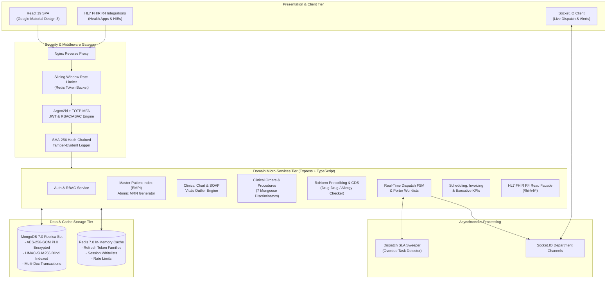

# Simulated Electronic Health Record (EHR) Platform

[](https://www.typescriptlang.org/)
[](https://reactjs.org/)
[](https://nodejs.org/)
[](https://www.mongodb.com/)
[](https://redis.io/)
[](https://hl7.org/fhir/R4/)
[](PROGRESS.md)
[](docs/SECURITY_AND_COMPLIANCE.md)

An enterprise-grade, HIPAA-compliant, multi-role Electronic Health Record (EHR) and clinical workflow management platform. Engineered with a domain-driven monorepo architecture, multi-tenant facility isolation, field-level PHI cryptography (AES-256-GCM + HMAC blind indexing), immutable SHA-256 hash-chained audit trails, real-time dispatch and diagnostics worklists, Clinical Decision Support (CDS), and an HL7 FHIR R4 interoperability layer.

---

## 1. System Architecture



---

## 2. Core Functional Modules

| Module | Core Capabilities | Regulatory / Standard |
| :--- | :--- | :--- |
| **Foundation & Security** | AES-256-GCM field-level PHI encryption, HMAC-SHA256 blind indexing, RFC 7807 problem details, health probes (`/health/live`, `/health/ready`). | HIPAA § 164.312(a)(2)(iv) |
| **Auth, RBAC & Audit** | Argon2id hashing, RFC 6238 TOTP MFA, rotating refresh token reuse breach detection, 9-role hierarchical RBAC, facility ABAC, SHA-256 hash-chained audit trails. | HIPAA § 164.312(b), (d) |
| **Patient Master Index** | Atomic sequential MRN generator (`MRN-FAC-YYYYMM-00001`), blind index exact search, probabilistic duplicate detection scoring, break-glass protocol, patient merge lineage. | ASTM E1384 EMPI |
| **Clinical Chart & Vitals** | Encounters (OPD/IPD/ER/Telehealth), digitally signed SOAP notes with immutable amendment addenda, vitals outlier and BMI calculation, ICD-10 problem lists, allergies, immunizations. | HL7 CDA / ICD-10-CM |
| **Orders & Procedures** | 7 polymorphic Mongoose discriminators (Lab, Imaging, Nursing, Consult, Dietary, Minor, Surgical), physician PIN electronic signature. | CPT / SNOMED-CT |
| **Prescribing & CDS Engine** | RxNorm drug catalog, real-time Clinical Decision Support (CDS) cross-checking for Drug-Drug interactions, Drug-Allergy contraindications, and duplicate therapies. | RxNorm / ONC CDS |
| **Real-Time Dispatch** | Finite State Machine (FSM), SLA background sweeper, wristband & specimen QR code generation/scanning, department worklists, Socket.IO real-time event rooms. | Hospital Transport SLA |
| **Scheduling & Billing** | Calendar double-booking prevention, itemized invoice generation, payment capture, financial ledger, executive KPI analytics (LOS, Occupancy, Revenue). | CMS UB-04 / HCFA-1500 |
| **HL7 FHIR R4 Facade** | RESTful read facade exposing `Patient`, `Encounter`, `Observation`, `Condition`, and `MedicationRequest` resources. | HL7 FHIR Release 4 |
| **Material Design 3 UI** | Modern Google Material Design 3 (M3) web interface, responsive navigation rail, persistent patient clinical banner, dispatch Kanban board, dark/light theme tokens. | Material Design 3 (M3) |

---

## 3. Technology Stack

* **Monorepo Architecture:** `npm` Workspaces, TypeScript 5.7 project references.
* **Shared Layer (`@ehr/shared`):** Zod runtime validation schemas, 37 permissions, 9 roles, clinical taxonomies (ICD-10, RxNorm, LOINC, CPT).
* **Backend API (`@ehr/api`):** Node.js 20, Express, TypeScript, Mongoose 8 (MongoDB 7.0 Replica Set), Redis 7.0, Socket.IO, Pino logging, Vitest.
* **Frontend Web (`@ehr/web`):** React 18/19, TypeScript, Vite 6, Google Material Design 3 (M3) Tokens, MUI v6, Lucide React, Zustand, React Router v6, TanStack React Query, Recharts.
* **DevOps & Containerization:** Multi-stage Dockerfiles, Docker Compose, Nginx reverse proxy.

---

## 4. Quick Start Guide

### Prerequisites
* **Node.js:** `>= 20.0.0`
* **npm:** `>= 10.0.0`
* **Docker & Docker Compose:** Installed and running

### Step 1: Clone and Install
```bash
git clone <repository-url>
cd "Simulated EHR"
npm install
```

### Step 2: Configure Environment
```bash
cp .env.example .env
```

### Step 3: Start Database Stack (MongoDB Replica Set & Redis)
```bash
docker compose up -d mongo redis
```

### Step 4: Seed Synthetic Clinical Data
```bash
npm run seed
```
> Populates the database with 300+ patients (encrypted PHI), 9 demo staff accounts, encounters, signed SOAP notes, vitals, orders, CDS prescriptions, dispatches, invoices, and a cryptographically valid SHA-256 audit chain.

### Step 5: Start Development Servers
```bash
npm run dev
```

* **Frontend Web App:** [http://localhost:3000](http://localhost:3000)
* **Backend API:** [http://localhost:5000/api/v1](http://localhost:5000/api/v1)
* **FHIR R4 Facade:** [http://localhost:5000/fhir/r4](http://localhost:5000/fhir/r4)

---

## 5. Demo Staff Accounts

All seeded demo accounts use the standard password: `Password@123!`

| Role | Email | Facility | Primary Workflow |
| :--- | :--- | :--- | :--- |
| **Super Admin** | `admin@ehrtest.local` | `FAC-MAIN` | Staff & Role Management, Master Audit Log |
| **Physician** | `dr.chen@ehrtest.local` | `FAC-MAIN` | Clinical Chart, SOAP Notes, Orders, CDS Prescriptions |
| **Nurse** | `nurse.patel@ehrtest.local` | `FAC-MAIN` | Triage, Vitals, Nursing Orders, Dispatch Tasks |
| **Pharmacist** | `pharm.rodriguez@ehrtest.local` | `FAC-MAIN` | Rx Verification, CDS Review, Medication Dispense |
| **Radiologist** | `dr.stone@ehrtest.local` | `FAC-MAIN` | Diagnostic Imaging Worklist & Report Authoring |
| **Lab Tech** | `tech.davis@ehrtest.local` | `FAC-MAIN` | Specimen Accessioning, Quantitative Lab Results |
| **Receptionist** | `reception.taylor@ehrtest.local` | `FAC-MAIN` | Patient Intake, Scheduling, Clinic Check-In |
| **Billing Officer** | `billing.martinez@ehrtest.local` | `FAC-MAIN` | Invoicing, Copayment Capture, Financial KPIs |
| **Compliance Auditor** | `auditor.kim@ehrtest.local` | `FAC-MAIN` | Tamper-Evident Audit Verification, Break-Glass Inspection |

---

## 6. Monorepo Structure

```
.
├── packages/
│   └── shared/                  # Shared Zod schemas, types, codes, constants (@ehr/shared)
├── apps/
│   ├── api/                     # Express REST, Socket.IO, FHIR R4 backend (@ehr/api)
│   └── web/                     # React 19 / Vite / Material Design 3 frontend (@ehr/web)
├── docs/                        # Complete Technical & Operational Documentation
│   ├── ARCHITECTURE.md          # Comprehensive System Architecture & Deep Dive
│   ├── SECURITY_AND_COMPLIANCE.md # HIPAA Safeguards, AES-256-GCM, Hash-Chained Audit
│   ├── API_REFERENCE.md         # REST Endpoints, Headers, Schemas & WebSocket Events
│   ├── CLINICAL_WORKFLOWS.md    # End-to-End Clinical, Diagnostic & Billing Workflows
│   ├── FHIR_R4_SPECIFICATION.md # HL7 FHIR R4 Read Facade Resource Mapping Guide
│   └── DEVELOPMENT_AND_DEPLOYMENT.md # Local Dev, Docker, Testing & Production Hardening
├── docker-compose.yml           # Multi-container orchestration (Mongo RS, Redis, API, Web)
├── tsconfig.base.json           # Shared TypeScript configuration
├── PROGRESS.md                  # Development verification and test results history
└── package.json                 # Monorepo root scripts and workspaces
```

---

## 7. Automated Test Suite

The system includes **69 automated tests** across 9 test suites running against an ephemeral in-memory MongoDB replica set:

```bash
# Run all monorepo test suites
npm test
```

```
Test Suites:
 ✓ foundation.test.ts             (8 tests)  - AES-256-GCM, Blind Indexing, RFC 7807, Health
 ✓ auth_rbac_audit.test.ts        (9 tests)  - Argon2id, TOTP, Token Reuse, 9-Role RBAC, Hash-Chain
 ✓ patients_search.test.ts        (7 tests)  - Patient Registration, Atomic MRN, Search, Merge
 ✓ clinical_chart.test.ts         (3 tests)  - Encounters, Signed SOAP Notes, Vitals BMI & Outliers
 ✓ procedures_prescriptions.test.ts (11 tests) - Discriminators, PIN Signature, RxNorm CDS Rules
 ✓ dispatch_worklists.test.ts     (8 tests)  - Dispatch FSM, SLA Sweeper, QR Codes, Socket Rooms
 ✓ scheduling_billing_fhir.test.ts(12 tests) - Double-Booking Prevention, Billing, FHIR R4 Facade
 ✓ authStore.test.ts              (7 tests)  - Zustand Auth State, Persistence & Permissions
 ✓ StatusChip.test.tsx            (4 tests)  - M3 Component Variant & Color Rendering

Test Files  9 passed (9)
Tests       69 passed (69)
```

---

## 8. Documentation Index

For in-depth technical documentation, refer to the specialized guides in `/docs`:

1. [**System Architecture & Technical Design (`docs/ARCHITECTURE.md`)**](docs/ARCHITECTURE.md)
2. [**Security, Cryptography & HIPAA Compliance (`docs/SECURITY_AND_COMPLIANCE.md`)**](docs/SECURITY_AND_COMPLIANCE.md)
3. [**API Reference & WebSocket Protocol (`docs/API_REFERENCE.md`)**](docs/API_REFERENCE.md)
4. [**Clinical Workflows & User Guides (`docs/CLINICAL_WORKFLOWS.md`)**](docs/CLINICAL_WORKFLOWS.md)
5. [**HL7 FHIR R4 Interoperability Specification (`docs/FHIR_R4_SPECIFICATION.md`)**](docs/FHIR_R4_SPECIFICATION.md)
6. [**Development, Seeding & Deployment Guide (`docs/DEVELOPMENT_AND_DEPLOYMENT.md`)**](docs/DEVELOPMENT_AND_DEPLOYMENT.md)
7. [**Shared Contracts (`packages/shared/README.md`)**](packages/shared/README.md)
8. [**Backend API Service (`apps/api/README.md`)**](apps/api/README.md)
9. [**Frontend Web Application (`apps/web/README.md`)**](apps/web/README.md)

---

## 9. License & Medical Disclaimer

This project is a simulated healthcare application developed for training, testing, and demonstration purposes. It demonstrates production-grade EHR architectures, HIPAA technical safeguards, and HL7 FHIR standards.
