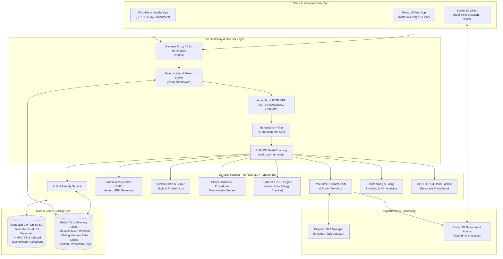
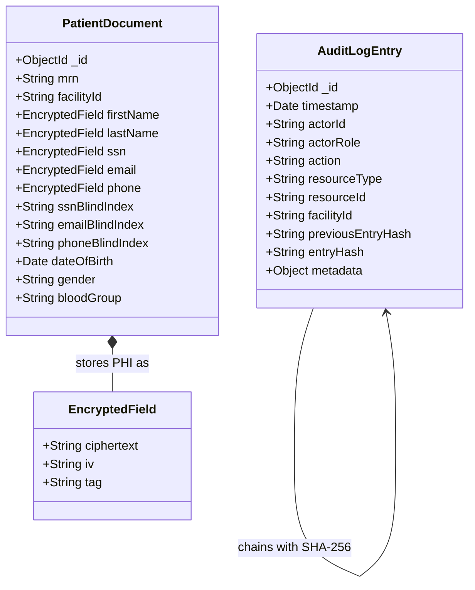

# System Architecture & Technical Design

**Simulated EHR** is an enterprise-grade, HIPAA-compliant, multi-role Electronic Health Record (EHR) and clinical workflow management platform. It is engineered with a modular Domain-Driven monorepo architecture, multi-tenant facility isolation, field-level PHI cryptography, real-time dispatch and diagnostics worklists, clinical decision support (CDS), and an HL7 FHIR R4 interoperability layer.

---

## 1. High-Level Architecture Diagram



---

## 2. Monorepo Organization & Boundaries

The codebase is organized as an `npm` workspace monorepo enforcing clean architectural separation between contract definitions, server-side business logic, and presentation:

```
├── packages/
│   └── shared/               # Shared Domain Contracts & Types (@ehr/shared)
│       ├── constants/        # Permissions, System Roles, Clinical Codes, Statuses
│       ├── schemas/          # Zod validation schemas for all domain entities
│       └── index.ts          # Public type definitions & constants
├── apps/
│   ├── api/                  # Backend REST & Socket Server (@ehr/api)
│   │   ├── src/
│   │   │   ├── config/       # Env validation, Pino logger, DB/Redis connections
│   │   │   ├── db/           # Schema definitions, Mongoose indexes, discriminators
│   │   │   ├── jobs/         # SLA sweeper & background workers
│   │   │   ├── middleware/   # RFC 7807, AuthN/AuthZ, Blind Index, Audit, Idempotency
│   │   │   ├── modules/      # Domain modules (controllers, services, routes)
│   │   │   ├── realtime/     # Socket.IO rooms & event dispatchers
│   │   │   ├── seed/         # Synthetic clinical data generator (300+ patients)
│   │   │   ├── tests/        # Vitest integration test suites (in-memory MongoDB)
│   │   │   └── utils/        # AES-256-GCM crypto & HMAC blind indexing helpers
│   │   ├── Dockerfile
│   │   └── vitest.config.ts
│   └── web/                  # Material Design 3 Web Application (@ehr/web)
│       ├── src/
│       │   ├── app/          # App root, React Router v6, Global Providers
│       │   ├── components/   # Common M3 UI (AppShell, NavRail, PatientBanner, Chips)
│       │   ├── features/     # Feature views (Admin, Patients, Chart, Dispatch, etc.)
│       │   ├── services/     # Axios API client & Socket.IO client
│       │   ├── stores/       # Zustand state stores (authStore, uiStore)
│       │   └── theme/        # Material Design 3 HSL design tokens & palette
│       ├── index.html
│       ├── vite.config.ts
│       └── Dockerfile
├── docker-compose.yml        # Orchestration for Mongo Replica Set, Redis, API, Web
├── tsconfig.base.json        # Unified TypeScript compiler settings
└── PROGRESS.md               # Historical development progress & test verification
```

---

## 3. Backend Domain Modules

The API server (`@ehr/api`) is partitioned into self-contained domain modules following Clean Architecture principles:

### 3.1 Authentication & RBAC (`modules/auth`, `modules/users`, `modules/roles`)
* **Password Security:** Multi-pass Argon2id hashing with per-user salt.
* **MFA (RFC 6238):** Time-based One-Time Passwords (TOTP) with Base32 secret generation and QR verification.
* **Token Rotation & Breach Detection:** Dual-token model (15-min JWT access token, 7-day rotating refresh token). Refresh tokens are tracked in Redis/MongoDB token families; reuse of an expired/revoked token triggers immediate revocation of the entire family.
* **9-Role Hierarchical RBAC:** Fine-grained permission assignments (`user:create`, `patient:break_glass`, `prescription:prescribe`, etc.).
* **Facility ABAC:** Mandatory `X-Facility-Id` context header validation ensuring cross-tenant isolation across multi-clinic hospital systems.

### 3.2 Patient Master Index (`modules/patients`, `modules/saved-searches`)
* **Deterministic Blind Indexing:** SSN, Email, and Phone are stored as AES-256-GCM ciphertexts with corresponding HMAC-SHA256 blind indexes allowing $O(1)$ indexed equality queries without ever exposing plaintext data to database logs or indexes.
* **Atomic MRN Generation:** Thread-safe sequential Medical Record Numbers formatted as `MRN-{FAC}-{YYYYMM}-{00001}` generated via MongoDB atomic counters (`$inc`).
* **Probabilistic Duplicate Detection:** Weighted matching algorithm evaluating Jaro-Winkler string distance across phonetic names, date of birth, and encrypted demographics.
* **Patient Merge Protocol:** Non-destructive target consolidation redirecting encounters, notes, vitals, orders, and invoices with an auditable merge lineage.

### 3.3 Clinical Chart & Vitals (`modules/encounters`, `modules/clinical-notes`, `modules/vitals`, `modules/problems`, `modules/allergies`, `modules/immunizations`, `modules/documents`)
* **Encounter Lifecycle:** Outpatient (OPD), Inpatient (IPD), Emergency (ER), and Telehealth encounters with state transitions (`ARRIVED` → `IN_PROGRESS` → `DISCHARGED` / `CANCELLED`).
* **Signed SOAP Notes & Amendments:** Subjective, Objective, Assessment, Plan (SOAP) clinical documentation. Notes are cryptographically signed with the physician's identity and timestamp. Once signed, notes are immutable; modifications require structured addenda (`amendments`).
* **Vitals & Outlier Alerting:** Automatic calculation of BMI and percentile classifications. Vital readings outside physiological bounds trigger high-visibility clinical alerts.
* **Standardized Ontologies:** Full support for ICD-10 problem lists, SNOMED-CT clinical observations, and RxNorm active medication reconciliation.

### 3.4 Clinical Orders & Procedure Discriminators (`modules/procedures`, `modules/orders`)
* **Polymorphic Discriminator Schemas:** Procedures and orders inherit from a base schema (`ProcedureModel`, `OrderModel`) into 7 distinct discriminators:
  1. `MinorProcedure` (Clinic/Bedside)
  2. `SurgicalProcedure` (OR / Anesthesia records)
  3. `LabOrder` (Specimen collection & reference ranges)
  4. `ImagingOrder` (Modality, radiation dosage & DICOM study links)
  5. `NursingOrder` (Shift-based care tasks)
  6. `ConsultOrder` (Inter-departmental specialist referrals)
  7. `DietaryOrder` (Clinical nutrition protocols)
* **Physician PIN Authorization:** Critical surgical and diagnostic orders require real-time 4–6 digit clinical PIN verification before persistence.

### 3.5 Prescriptions & Clinical Decision Support (CDS) (`modules/prescriptions`)
* **RxNorm Validation:** Structured formulation, strength, dosage, route, and frequency.
* **Multi-Tiered CDS Interaction Engine:** Evaluates prescriptions prior to final submission:
  - **Drug-Drug Interactions (DDI):** Detects contraindicated combinations (e.g., Warfarin + Aspirin, ACE Inhibitors + Potassium).
  - **Drug-Allergy Interactions:** Cross-references active patient allergy records (e.g., Penicillin allergy vs. Amoxicillin order).
  - **Duplicate Therapy Alerts:** Identifies simultaneous overlapping therapeutic classes.

### 3.6 Real-Time Dispatch & Diagnostic Worklists (`modules/dispatch`, `modules/diagnostics`, `modules/departments`, `realtime/socket.ts`)
* **Finite State Machine (FSM):** Strict dispatch task transitions:
  $$\text{PENDING} \longrightarrow \text{ASSIGNED} \longrightarrow \text{IN\_TRANSIT} \longrightarrow \text{ARRIVED} \longrightarrow \text{COMPLETED} \quad (\text{or } \text{CANCELLED})$$
* **QR Code Verification:** Patient and specimen wristband verification via base64 QR generation (`qrcode.react`).
* **Department Room Sockets:** WebSocket events partitioned into department channels (`dept:LAB`, `dept:RADIOLOGY`, `dept:PHARMACY`, `facility:{id}`).
* **SLA Sweeper Job:** Background worker inspecting dispatch tasks every 60 seconds. Tasks exceeding department SLA thresholds (e.g., 30 minutes for STAT transport) trigger `sla:breached` WebSocket alerts.

### 3.7 Scheduling, Invoicing & KPI Analytics (`modules/appointments`, `modules/billing`, `modules/reports`)
* **Appointment Conflict Prevention:** Database-level index locking and double-booking prevention across provider time slots.
* **Comprehensive Invoicing:** Automated itemized billing aggregating bed charges, procedure codes, diagnostic tests, and dispensed medications.
* **Executive KPI Dashboards:** Real-time metrics calculating average Length of Stay (LOS), Bed Occupancy Rate (BOR), 30-day readmission rate, daily revenue, and dispatch SLA compliance.

### 3.8 HL7 FHIR R4 Read Facade (`modules/fhir`)
* Read-only REST facade adhering to the HL7 FHIR Release 4 standard.
* Provides search and retrieval for:
  - `GET /fhir/r4/Patient`
  - `GET /fhir/r4/Encounter`
  - `GET /fhir/r4/Observation` (Vitals & Labs)
  - `GET /fhir/r4/Condition` (ICD-10 Problems)
  - `GET /fhir/r4/MedicationRequest` (Prescriptions)

---

## 4. Cryptographic & Data Architecture



---

## 5. Frontend Client Architecture (`@ehr/web`)

The frontend application is built on **React 18/19**, **TypeScript 5.7**, **Vite 6**, and **Google Material Design 3 (M3)**:

* **M3 Design Token System (`src/theme/`):** Harmonious HSL color palettes for light/dark themes, tonal surface containers, elevation levels 0–5, state layers (hover, focus, pressed), and responsive typography.
* **Component Hierarchy:**
  - `AppShell`: Persistent App Bar, Breadcrumbs, Facility Switcher, User Profile, Break-Glass Indicator.
  - `NavRail`: Responsive navigation rail collapsing to bottom bar on mobile viewports.
  - `PatientBanner`: High-context clinical header displaying patient photo, MRN, Age/Gender, Blood Group, Active Allergies (with high-visibility badges), and Code Status (DNR/FULL_CODE).
  - `DispatchKanban`: Drag-and-drop / status-driven dispatch board with live SLA timers and audio-visual breach alerts.
* **State Management:**
  - `authStore` (Zustand): User session, active facility context, permissions matrix, break-glass session tokens, with cross-tab sync and SSR-safe fallback storage.
  - `uiStore` (Zustand): Active patient context, drawer states, theme toggles, modal controllers.
  - `TanStack React Query`: Server-state caching, background revalidation, optimistic mutations, and window focus refetching.
