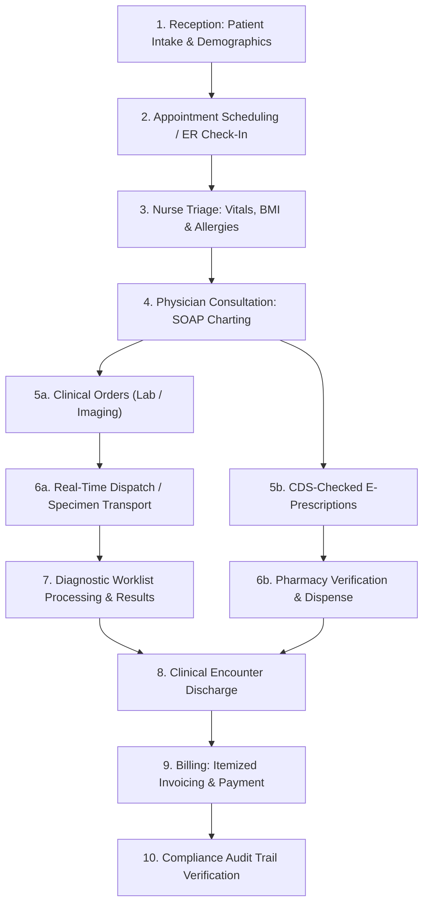
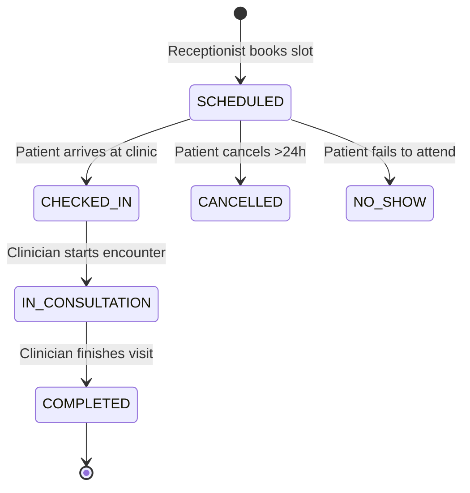
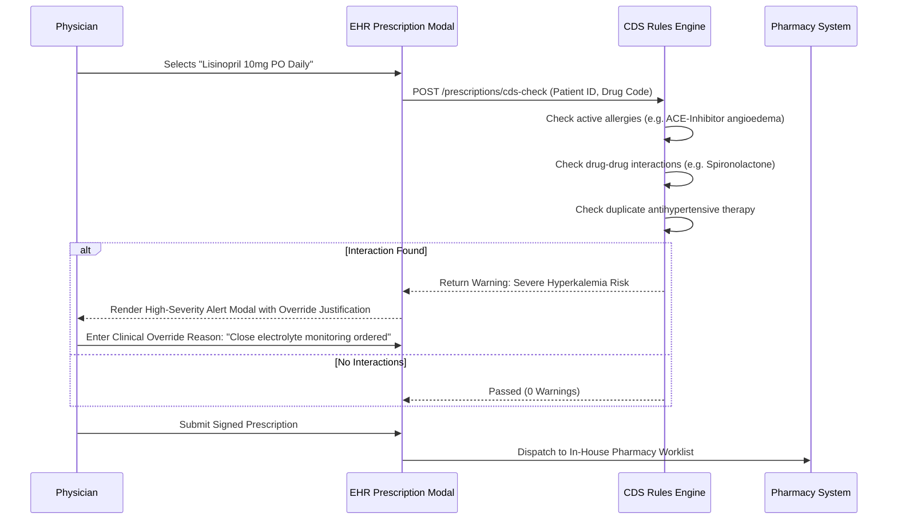

# Clinical Workflows & User Guides

This document provides a comprehensive operational guide to the clinical, administrative, diagnostic, and financial workflows supported by the **Simulated EHR** platform.

---

## 1. End-to-End Patient Journey

---

## 2. Patient Intake & Master Index (EMPI)

### 2.1 Patient Registration
1. The **Receptionist** navigates to **Patients** → **Register Patient**.
2. Enters demographic details (Legal Name, DOB, Gender, SSN, Phone, Email, Address, Emergency Contact, Blood Group).
3. **Automated Cryptography:**
   - The backend encrypts SSN, Name, Email, and Phone using **AES-256-GCM**.
   - Generates deterministic **HMAC-SHA256 Blind Indexes** for sub-millisecond searchability.
   - Generates an atomic sequential Medical Record Number: `MRN-{FACILITY}-{YYYYMM}-{INDEX}`.

### 2.2 Probabilistic Duplicate Detection
* Before registration is finalized, the system runs a similarity query across existing patients:
  - If a potential duplicate is detected (e.g. matching DOB and phonetic last name with >0.85 similarity score), the system displays a side-by-side comparison modal.
  - The receptionist can choose to **Confirm New Patient** or **Select Existing Patient**.

### 2.3 Patient Record Merge
* Authorized staff (`patient:merge`) can merge duplicate medical records:
  - Select `Source Patient` (to be merged) and `Target Patient` (to retain).
  - All past encounters, clinical notes, vitals, orders, invoices, and audit logs are safely reassigned to the target patient.
  - The source record is marked as `MERGED` with a permanent redirection pointer.

---

## 3. Scheduling & Appointment Lifecycle

* **Double-Booking Protection:** Provider calendars are protected by compound MongoDB unique indexes `(providerId, facilityId, startTime)`.
* **Appointment Types:** Outpatient Initial Consult, Follow-Up, Annual Physical, Telehealth Video Visit, and Emergency Walk-In.

---

## 4. Nursing Triage & Vitals Acquisition

1. The **Nurse** opens the patient's active encounter from the clinical queue.
2. Enters physiological vital signs:
   - Systolic & Diastolic Blood Pressure (mmHg)
   - Heart Rate (BPM) & Respiratory Rate (breaths/min)
   - Body Temperature (°F or °C)
   - Pulse Oximetry ($\text{SpO}_2\%$)
   - Height (cm) & Weight (kg)
3. **Automated Clinical Computing:**
   - **BMI Calculation:** $\text{BMI} = \frac{\text{Weight (kg)}}{(\text{Height (m)})^2}$, categorizing into Underweight, Normal, Overweight, Obese.
   - **Outlier Alerts:** Values outside standard physiological envelopes (e.g., $\text{Systolic} > 180$, $\text{SpO}_2 < 90\%$) trigger high-visibility amber/red banner notifications and broadcast a `vital:alert` event to the nursing station.
4. **Allergy Documentation:** Document drug, food, or environmental allergies with severity levels (`MILD`, `MODERATE`, `SEVERE`, `ANAPHYLACTIC`).

---

## 5. Physician Consultation & SOAP Documentation

1. The **Physician** opens the **Clinical Chart** view.
2. Reviews past medical history, longitudinal vitals trend graphs, active problem list, and medication profile.
3. Documents visit using the **SOAP Template**:
   - **Subjective (S):** Chief complaint, history of present illness (HPI), review of systems.
   - **Objective (O):** Physical examination findings, vital signs summary.
   - **Assessment (A):** Differential diagnosis mapped to standard **ICD-10** codes (e.g., `I10 - Essential Hypertension`).
   - **Plan (P):** Diagnostic orders, prescriptions, follow-up timelines, patient education.
4. **Digital Signature & Sealing:**
   - The physician clicks **Sign Note**, entering their clinical PIN.
   - The note is sealed with an electronic signature hash and marked immutable.
   - Any post-signing modifications require submitting an **Amendment Addendum**.

---

## 6. Clinical Decision Support (CDS) & E-Prescribing

---

## 7. Real-Time Hospital Dispatch & Porter Tracking

For specimen transport, patient escort to radiology, and emergency equipment transfers:

1. Clinician generates a **Dispatch Task** with priority (`ROUTINE`, `URGENT`, `STAT`).
2. The task appears instantly on the **Dispatch Kanban Board** via WebSockets.
3. A porter claims the task (`PENDING` → `ASSIGNED`).
4. Upon picking up the specimen or patient, the porter scans the **QR code** on the wristband or specimen label (`ASSIGNED` → `IN_TRANSIT`).
5. Upon arrival at the target department (e.g. Central Lab), the destination tech scans the QR code to confirm delivery (`ARRIVED` → `COMPLETED`).
6. **SLA Sweeper:** Background cron monitors open tasks; if a `STAT` task remains uncompleted past its SLA limit (e.g., >20 mins), a pulsing visual and audible alert is broadcast across department dashboards.

---

## 8. Diagnostic Worklists (Lab & Radiology)

### 8.1 Laboratory Tech Workflow
* Access the **Lab Worklist** filtered by status (`PENDING`, `IN_ANALYSIS`, `COMPLETED`).
* Input quantitative test values (e.g. Serum Potassium: `4.8 mEq/L`).
* Reference ranges automatically color-code results (Green = Normal, Amber = Abnormal, Red = Critical Panic Value).
* Authorize and release findings directly to the patient's longitudinal clinical chart.

### 8.2 Radiologist Workflow
* Open **Imaging Worklist** for scheduled X-Ray, CT, and MRI orders.
* Review clinical indication, attach DICOM study metadata / PACS accession numbers.
* Authorize structured diagnostic radiology reports (Technique, Findings, Impression).

---

## 9. Discharge, Invoicing & Settlement

1. The physician executes the **Discharge Workflow**, generating patient discharge instructions, medication reconciliation summaries, and follow-up schedules.
2. The **Billing Officer** opens **Billing & Invoices**:
   - The billing engine automatically aggregates billable encounter items:
     - Consultation fees
     - Bed day charges (IPD)
     - Completed laboratory panels
     - Radiology imaging procedures
     - Dispensed pharmacy medications
   - Generates an itemized invoice (PDF-ready).
3. Record insurance claims or patient copayments (`CASH`, `CREDIT_CARD`, `INSURANCE_DIRECT`).
4. Finalize invoice status to `PAID`.
