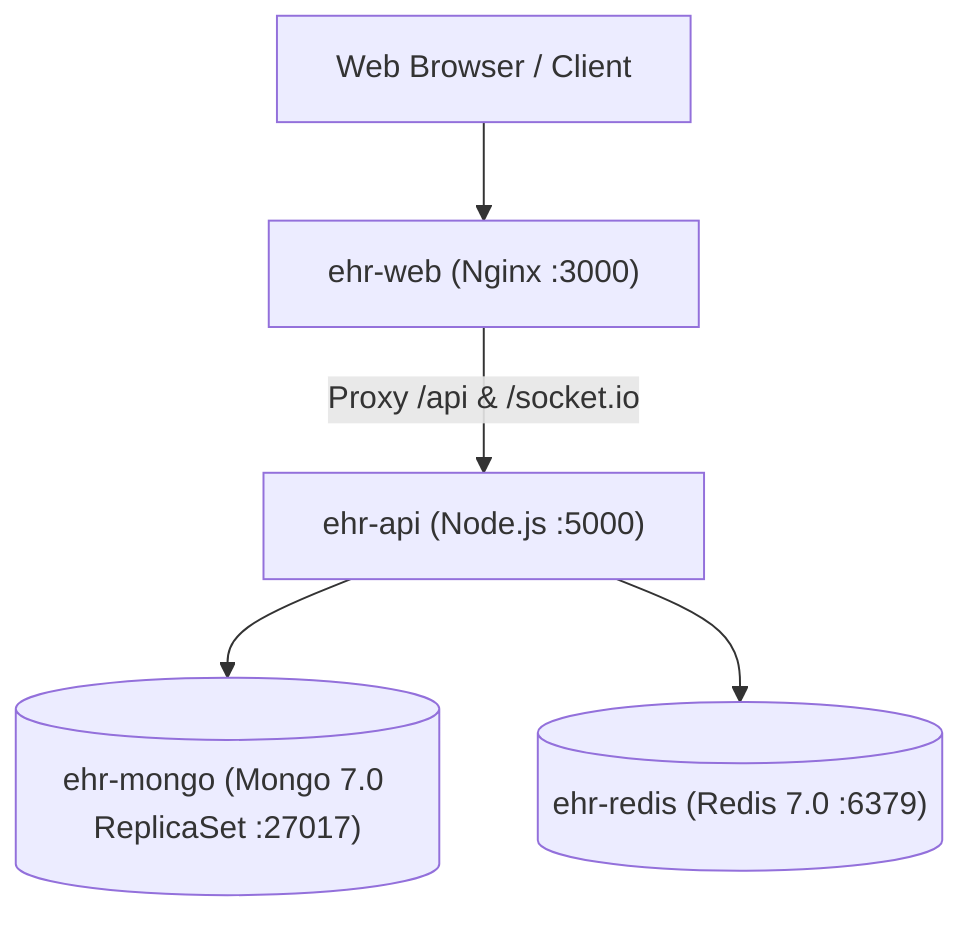

# Development, Seeding & Deployment Guide

This guide details the complete developer lifecycle for the **Simulated EHR** platform, including local environment configuration, database seeding, automated testing, Docker orchestration, and production hardening.

---

## 1. Prerequisites & System Requirements

* **Node.js:** `>= 20.0.0` (LTS recommended)
* **Package Manager:** `npm >= 10.0.0`
* **Docker & Docker Compose:** Docker Engine `24+` / Compose `v2+` (for containerized Mongo replica set and Redis)
* **Memory & Storage:** Minimum 4GB RAM, 10GB free disk space

---

## 2. Quick-Start Local Development

### 2.1 Clone & Install Dependencies
```bash
# Clone the repository
git clone <repository-url>
cd "Simulated EHR"

# Install all monorepo dependencies
npm install
```

### 2.2 Configure Environment Variables
Copy the example environment file:
```bash
cp .env.example .env
```

Verify the cryptographic keys in `.env` (or generate fresh 256-bit hex keys for production):
```bash
# Generate 256-bit (32-byte) hex keys using Node.js crypto
node -e "console.log(require('crypto').randomBytes(32).toString('hex'))"
```

### 2.3 Start Database Stack (MongoDB Replica Set & Redis)
MongoDB must be configured as a replica set to support multi-document transactions and atomic counters.

Using Docker Compose:
```bash
# Start MongoDB (configured as single-node replica set rs0) and Redis
docker compose up -d mongo redis
```

### 2.4 Seed Synthetic Clinical Database
Populate the database with realistic healthcare data:
```bash
npm run seed
```
> **What this does:** Generates 300+ patient records with AES-256-GCM encrypted PHI and HMAC blind indexes, 9 standard system roles, 9 demo staff accounts, 900+ encounters, SOAP clinical notes, longitudinal vitals, clinical orders, active prescriptions, real-time dispatch tasks, billing invoices, and a cryptographically valid SHA-256 hash-chained audit trail.

### 2.5 Start Development Servers
```bash
# Launches both API (Port 5000) and Web (Port 3000) concurrently
npm run dev
```

* **Frontend Web App:** [http://localhost:3000](http://localhost:3000)
* **Backend API:** [http://localhost:5000/api/v1](http://localhost:5000/api/v1)
* **FHIR R4 Facade:** [http://localhost:5000/fhir/r4](http://localhost:5000/fhir/r4)
* **Mongo Express GUI (optional dev profile):** `docker compose --profile dev up -d mongo-express` → [http://localhost:8081](http://localhost:8081)

---

## 3. Demo Staff Accounts & Credentials

All seeded demo accounts are initialized with password: `Password@123!`

| Role | Email | Default Facility | Primary Capabilities |
| :--- | :--- | :--- | :--- |
| **Super Admin** | `admin@ehrtest.local` | `FAC-MAIN` | User & Role Management, Master Audit Log, System Settings |
| **Physician** | `dr.chen@ehrtest.local` | `FAC-MAIN` | Clinical Charts, SOAP Notes, Orders, RxNorm Prescriptions, Break-Glass |
| **Nurse** | `nurse.patel@ehrtest.local` | `FAC-MAIN` | Triage, Vitals Recording, Nursing Orders, Dispatch Creation |
| **Pharmacist** | `pharm.rodriguez@ehrtest.local` | `FAC-MAIN` | Prescription Verification, CDS Overrides, Medication Dispensing |
| **Radiologist** | `dr.stone@ehrtest.local` | `FAC-MAIN` | Imaging Worklists, DICOM Review, Diagnostic Report Authoring |
| **Lab Tech** | `tech.davis@ehrtest.local` | `FAC-MAIN` | Specimen Accessioning, Lab Worklist, Quantitative Result Entry |
| **Receptionist** | `reception.taylor@ehrtest.local` | `FAC-MAIN` | Patient Intake, Demographics, Scheduling, Clinic Check-In |
| **Billing Officer** | `billing.martinez@ehrtest.local` | `FAC-MAIN` | Charge Invoicing, Payment Capture, Insurance Claims, Financial KPIs |
| **Compliance Auditor** | `auditor.kim@ehrtest.local` | `FAC-MAIN` | Tamper-Evident Audit Verification, Break-Glass Emergency Log Inspection |

---

## 4. Automated Testing & Verification

The project includes 69 automated tests across 9 comprehensive test suites utilizing **Vitest** and **`mongodb-memory-server`** (which automatically spins up an in-memory MongoDB replica set for zero-dependency test execution).

### 4.1 Run Test Suite
```bash
# Execute all backend integration and frontend unit test suites
npm test
```

### 4.2 Test Suites Breakdown
1. **`foundation.test.ts`**: AES-256-GCM PHI encryption/decryption, HMAC-SHA256 blind indexing, RFC 7807 problem details, health endpoints.
2. **`auth_rbac_audit.test.ts`**: Argon2id auth, TOTP MFA, rotating refresh token reuse breach detection, 9-role RBAC authorization matrix, SHA-256 audit hash-chaining and tamper verification.
3. **`patients_search.test.ts`**: Patient intake, atomic MRN counter (`mrn:FAC`), blind index exact search, duplicate detection similarity scoring, break-glass logging, record merge.
4. **`clinical_chart.test.ts`**: Encounters (OPD/IPD/ER/Telehealth), digitally signed SOAP notes, immutable amendment addenda, vitals outlier and BMI calculation.
5. **`procedures_prescriptions.test.ts`**: 7 Mongoose procedure/order discriminators, physician PIN authorization, RxNorm prescribing, CDS engine (drug-drug, drug-allergy, duplicate therapy).
6. **`dispatch_worklists.test.ts`**: Dispatch Finite State Machine, SLA sweeper, QR codes, diagnostic worklists (Lab, Pharmacy, Radiology), Socket.IO department rooms.
7. **`scheduling_billing_fhir.test.ts`**: Calendar double-booking prevention, invoicing, payments, KPI analytics, HL7 FHIR R4 read facade (`/fhir/r4/*`).
8. **`authStore.test.ts`**: Frontend Zustand authentication store, login state persistence, permissions decoding, and role evaluation.
9. **`StatusChip.test.tsx`**: Material Design 3 StatusChip component variant and color rendering.

---

## 5. Production Docker Deployment

The application is fully containerized using multi-stage Docker builds.

### 5.1 Full Production Stack Launch
```bash
# Build production images and start all services
docker compose up -d --build
```

### 5.2 Container Topology



---

## 6. Environment Configuration Reference

| Variable | Type | Default / Example | Purpose |
| :--- | :--- | :--- | :--- |
| `NODE_ENV` | String | `production` \| `development` | Runtime environment mode |
| `PORT` | Number | `5000` | Backend API listening port |
| `MONGO_URI` | String | `mongodb://mongo:27017/ehr?replicaSet=rs0` | MongoDB connection URI with replica set |
| `REDIS_URL` | String | `redis://redis:6379` | Redis connection URL |
| `JWT_ACCESS_SECRET` | 256-bit Hex | *Required* | Secret key for signing 15-min access tokens |
| `JWT_REFRESH_SECRET` | 256-bit Hex | *Required* | Secret key for rotating refresh tokens |
| `FIELD_ENCRYPTION_KEY`| 256-bit Hex | *Required* | AES-256-GCM symmetric key for PHI fields |
| `BLIND_INDEX_SALT` | 256-bit Hex | *Required* | HMAC-SHA256 secret salt for deterministic indexing |
| `CORS_ORIGIN` | String | `http://localhost:3000` | Allowed origins for CORS and Socket.IO |
| `LOG_LEVEL` | String | `info` \| `debug` \| `warn` | Pino logger verbosity level |

---

## 7. Production Hardening Checklist

- [ ] **Cryptographic Key Management:** Rotate `FIELD_ENCRYPTION_KEY` and `BLIND_INDEX_SALT` using a dedicated Key Management Service (AWS KMS, HashiCorp Vault, or GCP Cloud KMS).
- [ ] **TLS Enforcement:** Terminate TLS 1.3 at Nginx or cloud load balancer with HSTS (`Strict-Transport-Security`).
- [ ] **Database Replication & Backups:** Deploy a 3-node MongoDB replica set across separate availability zones with automated daily snapshot backups.
- [ ] **Audit Trail Archival:** Periodically export sealed SHA-256 hash-chained audit blocks to WORM (Write Once, Read Many) cloud storage (e.g. AWS S3 Object Lock).
- [ ] **Rate Limiting Hardening:** Adjust Redis rate-limiting thresholds to match hospital network topology and enterprise gateway IP ranges.
