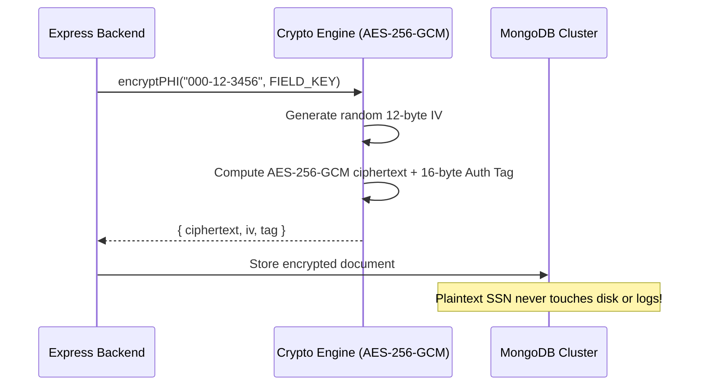
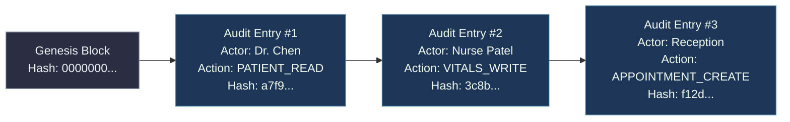
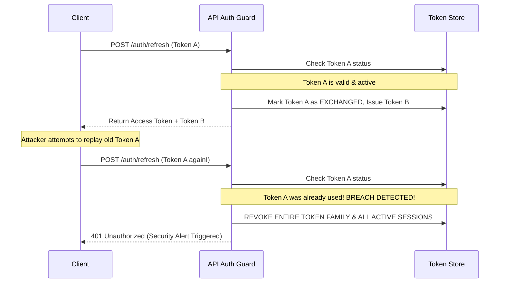

# Security, Cryptography & HIPAA Compliance

The **Simulated EHR** platform is engineered to exceed the rigorous security, privacy, and integrity mandates outlined in the **Health Insurance Portability and Accountability Act (HIPAA)** Security Rule (45 CFR Part 160 and Part 164, Subparts A and C) and the **HITECH Act**.

---

## 1. HIPAA Technical Safeguards (§ 164.312) Mapping

| HIPAA Specification | Standard & Regulatory Reference | Simulated EHR Implementation | Verification / Evidence |
| :--- | :--- | :--- | :--- |
| **Access Control** | § 164.312(a)(1) — Unique user identification & emergency access | Unique UUID/ObjectID per user, Argon2id credentials, TOTP MFA, Break-Glass emergency protocol with mandatory justification. | `authn.middleware.ts`, `authStore.ts` |
| **Emergency Access ("Break-Glass")** | § 164.312(a)(2)(ii) — Emergency access procedure | Dedicated `patient:break_glass` permission allowing temporary override of facility/assignment restrictions with high-priority audit triggers. | `patients.controller.ts`, `audit.model.ts` |
| **Automatic Logoff** | § 164.312(a)(2)(iii) — Inactive session termination | Short-lived JWT access tokens (15-minute expiry) and automatic frontend inactivity listeners. | `authStore.ts`, `jwt.util.ts` |
| **Encryption and Decryption** | § 164.312(a)(2)(iv) — At-rest PHI encryption | Field-level AES-256-GCM envelope encryption for all direct Protected Health Information (PHI) identifiers. | `crypto.util.ts`, `patient.model.ts` |
| **Audit Controls** | § 164.312(b) — Activity recording and examination | Immutable, cryptographically hash-chained (SHA-256) audit logs capturing every read, write, export, auth event, and break-glass invocation. | `audit.middleware.ts`, `audit.service.ts` |
| **Integrity & Tamper Evidence** | § 164.312(c)(1) — Protect electronic PHI from improper alteration | SHA-256 hash chaining of audit records and electronic signature sealing for clinical SOAP notes. | `clinical-notes.service.ts`, `audit.test.ts` |
| **Transmission Security** | § 164.312(e)(1) — Guard against unauthorized network access | Strict TLS 1.3 encryption in transit, Redis TLS support, Secure cookie flags, and Content Security Policies. | `server.ts`, `nginx.conf` |

---

## 2. Field-Level Protected Health Information (PHI) Cryptography

To protect patient privacy against database leaks, backup compromises, and insider threats, all direct identifiers (SSN, Full Legal Name, Email, Phone Number, Home Address) are encrypted at the field level before being committed to MongoDB.

### 2.1 Encryption Scheme: AES-256-GCM
* **Algorithm:** Advanced Encryption Standard (AES) in Galois/Counter Mode (GCM).
* **Key Size:** 256 bits (32 bytes), supplied via the environment variable `FIELD_ENCRYPTION_KEY`.
* **Initialization Vector (IV):** Unique, cryptographically random 12-byte (96-bit) IV generated per encryption operation via `crypto.randomBytes(12)`.
* **Authentication Tag:** 16-byte (128-bit) GCM authentication tag verifying ciphertext authenticity and detecting tampering.

```typescript
// Field Storage Structure in MongoDB
export interface EncryptedPayload {
  ciphertext: string; // Base64 or Hex encoded AES-256 ciphertext
  iv: string;         // 12-byte initialization vector (hex)
  tag: string;        // 16-byte GCM authentication tag (hex)
}
```



---

## 3. Deterministic Blind Indexing (HMAC-SHA256)

Because standard AES-256-GCM ciphertexts are non-deterministic (a different IV is generated each time), searching for an encrypted SSN, email, or phone number would ordinarily require a full collection scan and decryption in memory.

**Simulated EHR solves this using Blind Indexing:**

* **Algorithm:** HMAC-SHA256 using a distinct, high-entropy secret (`BLIND_INDEX_SALT`).
* **Normalization:** Input strings are lowercased and stripped of non-alphanumeric characters prior to hashing.
* **Deterministic Output:** `blindIndex = HMAC_SHA256(normalizedText, BLIND_INDEX_SALT)`.
* **Query Performance:** Exact-match searches (`find({ ssnBlindIndex: computedHash })`) execute at $O(1)$ index speeds across millions of records without exposing plaintext values or decrypting unauthorized records.

---

## 4. Tamper-Evident SHA-256 Hash-Chained Audit Trail

HIPAA § 164.312(b) requires comprehensive auditing that cannot be silently modified, pruned, or manipulated—even by database administrators.

### 4.1 Merkle / Blockchain-Style Hash Chaining
Each audit log entry computes a cryptographic SHA-256 digest of its own contents concatenated with the hash of the preceding entry:

$$\text{EntryHash}_n = \text{SHA-256}\Big(\text{EntryHash}_{n-1} \,\|\, \text{Timestamp} \,\|\, \text{ActorID} \,\|\, \text{Action} \,\|\, \text{ResourceID} \,\|\, \text{FacilityID} \,\|\, \text{MetadataDigest}\Big)$$



### 4.2 Integrity Verification API
The system provides a continuous verification endpoint (`GET /api/v1/audit/verify`) that iterates through the audit sequence, recalculating all hashes. If any record is modified or deleted in MongoDB, the chain breaks immediately, pinpointing the exact corrupted block.

---

## 5. Authentication, MFA & Token Family Security

### 5.1 Password Hashing: Argon2id
* **Parameters:** `memoryCost: 65536 KB (64MB)`, `timeCost: 3 iterations`, `parallelism: 4 threads`.
* Compliant with OWASP Password Storage Guidelines.

### 5.2 TOTP Multi-Factor Authentication (RFC 6238)
* Time-step: 30 seconds, 6-digit dynamic codes.
* Secret keys generated using cryptographically secure 20-byte random buffers encoded in Base32.
* Mandatory MFA enforcement configurable per role (e.g., Physician, Super Admin).

### 5.3 Rotating Refresh Token Families & Breach Detection
* **Access Tokens:** Short-lived (15 minutes), digitally signed with `JWT_ACCESS_SECRET`.
* **Refresh Tokens:** Single-use, rotating with each token exchange.
* **Reuse Detection:** Every refresh token is part of a `TokenFamily`. If an already-spent refresh token is presented (indicating a stolen token), the backend immediately revokes all tokens within that family, logging a critical security event and forcing all active sessions for that user to re-authenticate.



---

## 6. Role-Based Access Control (RBAC) & Facility-Scoped ABAC

### 6.1 The 9 System Roles
1. **`SUPER_ADMIN`**: Full system administration, role configuration, facility provisioning, master audit inspection.
2. **`PHYSICIAN`**: Patient charts, encounter creation, SOAP notes, orders, RxNorm prescribing, surgical procedures.
3. **`NURSE`**: Patient triage, vitals recording, nursing orders, minor procedures, specimen collection.
4. **`RECEPTIONIST`**: Patient intake, scheduling, demographics updates, check-in.
5. **`LAB_TECH`**: Laboratory worklist access, specimen accessioning, test result entry, critical value reporting.
6. **`RADIOLOGIST`**: Imaging worklists, modality scheduling, DICOM study review, diagnostic report authoring.
7. **`PHARMACIST`**: Prescription verification, drug interaction review, dispensing workflows, medication reconciliation.
8. **`BILLING_OFFICER`**: Charge capture, invoicing, payment receipting, claims generation, financial reporting.
9. **`COMPLIANCE_AUDITOR`**: Read-only access to tamper-evident audit logs, break-glass logs, and compliance analytics.

### 6.2 Break-Glass Emergency Access Protocol
In critical life-or-death situations where a clinician requires immediate access to a patient outside their assigned department or facility:
1. The clinician requests emergency access by sending the header `X-Break-Glass-Reason: "Unconscious trauma patient in ED"`.
2. The API grants temporary access while creating a **high-severity, non-repudiable audit event**.
3. Automated alerts notify the Hospital Compliance Officer for mandatory 24-hour retrospective review.

---

## 7. API Defense-in-Depth & Request Hardening

* **Rate Limiting:** Sliding-window token bucket in Redis restricting unauthenticated auth attempts (5 req/min) and general API calls (120 req/min).
* **Idempotency Filter:** `X-Idempotency-Key` tracking ensures financial transactions, order submissions, and dispatch triggers are executed exactly once.
* **RFC 7807 Problem Details:** All API errors return standardized, sanitized Problem Details without stack traces or sensitive internal database details in production.
